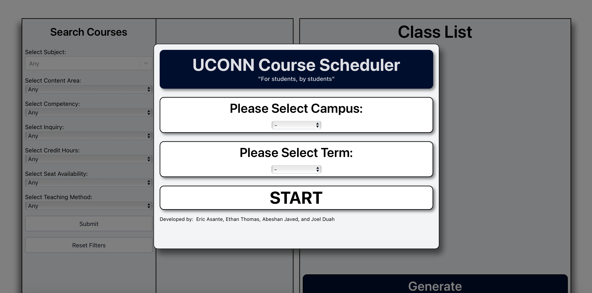
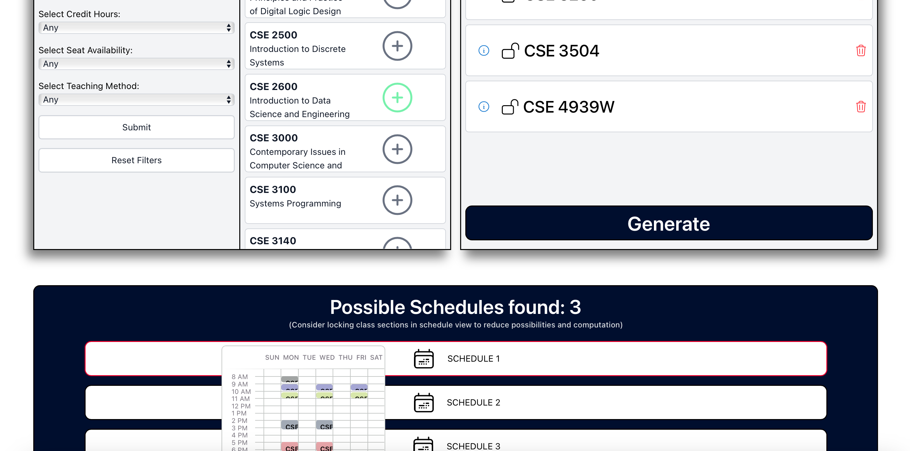

# UCONN Course Scheduler Setup

<table>
  <tr>
    <td></td>
    <td></td>
  </tr>
</table>

Docker commands at bottom  
Follow these steps to use the course scheduler. Skip any steps you have already completed. Please read over these steps carefully and have these steps open before moving on to the next step.  
If asked to allow anything or accept anything, do so. If there is something that pops up on your screen that isn't in the instructions, you can probably ignore it.

---

## Prerequisites

1. **Download VSCODE (Visual Studio Code)**  
   [VSCODE Download](https://code.visualstudio.com/Download)  
   Run the exe file and keep clicking next, minimize the VSCode tab; we will use it later.

2. **Download Git**  
   [Git Download](https://git-scm.com/downloads)  
   Run the exe file and keep clicking next.  
   If asked where to open, click VSCode and close out of the file.

3. **Download Docker**  
   [Docker Download](https://www.docker.com/)  
   Run the exe file and keep clicking next. You will be asked to restart—do so.  
   
   *After installation:*
   - Search for Docker on the taskbar search bar and open Docker.
   - If it takes too long to load, close and reopen it. If it still won't load, you can also end the task in Task Manager by right-clicking the taskbar, clicking Task Manager, left-clicking Docker Backend, and clicking "End Task."
   - If Docker refuses to open, copy the command, open Command Prompt through the taskbar, paste the command into Command Prompt, accept everything, and continue back to opening Docker.
   - You can choose to create an account or skip.
   - Once open, do not click anything; just leave it open and minimize the tab.

---

## Setup Instructions

1. **Create a Project Folder**  
   Open your file system (the file logo on the taskbar) and create a folder in a suitable location (such as Documents) called `Scheduler`.

2. **Open the Folder in VSCode**  
   - Launch VSCode.
   - Click **File** in the top left corner, then **Open Folder**.
   - Navigate to and select the `Scheduler` folder you just created.

3. **Clone the Repository**  
   - In VSCode, open the terminal by clicking **Terminal** > **New Terminal**.
   - Copy and paste the following command into the terminal at the bottom of the screen and hit **Enter**:
     ```bash
     git clone "https://github.com/EricAsante3/UCONN-course-scheduler.git"
     ```

4. **Navigate to the Project Directory**  
   In the terminal, run:
   ```bash
   cd UCONN-course-scheduler
   ```

5. **Build and Run Docker Containers**  
   Execute the following commands one by one. The first two commands may take some time to run—be patient and wait until each finishes before proceeding to the next. **Make sure to include the period at the end of the build commands.**
   ```bash
   docker build -f Containerization/Dockerfile.frontend -t frontend .
   ```
   ```bash
   docker build -f Containerization/Dockerfile.backend -t backend .
   ```
   ```bash
   docker run -d -p 5173:5173 frontend
   ```
   ```bash
   docker run -d -p 5123:5123 backend
   ```

6. **Access the Application**  
   Open a browser and enter the following URL: If it doesn't work on your browser, use Google Chrome.
   ```bash
   http://localhost:5173/
   ```

7. **Final Steps**  
   - Once your schedule is built, remember to register for your courses on Student Admin.
   - You can leave the filters as "Any."
   - Return to the VSCode terminal and run the following command to stop the Docker containers **after** finishing building your schedule:
   ```bash
   docker kill $(docker ps -aq)
   
