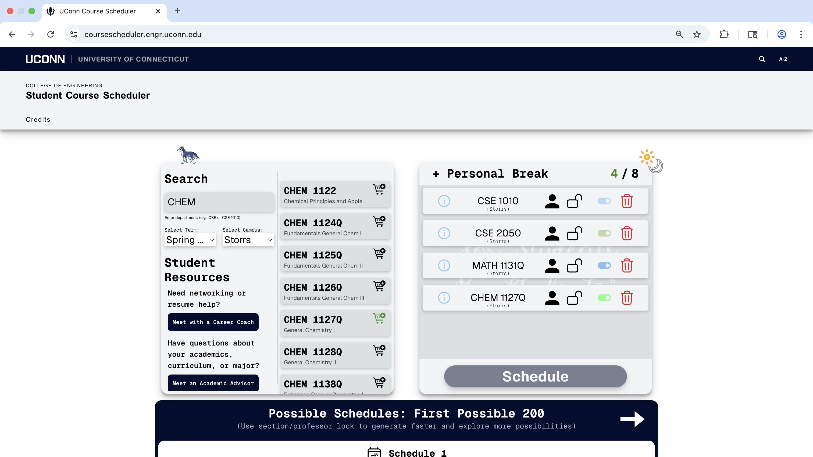
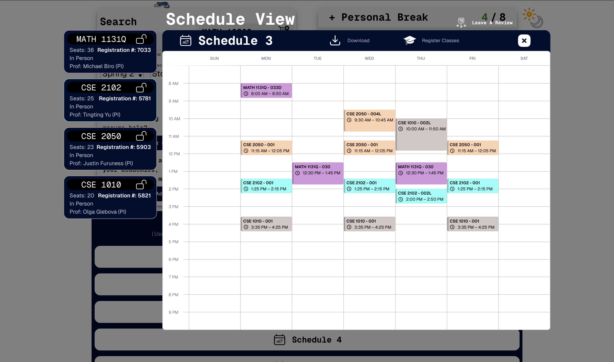
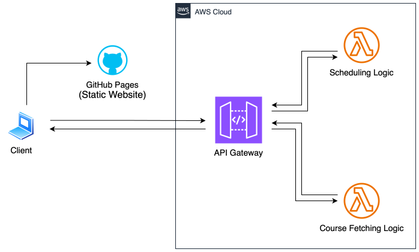

# UCONN Course Scheduler

This project is a course scheduling application for UConn students. 
It consists of multiple backend services and a frontend application.

## [Visit Website Here](https://ericasante3.github.io/UCONN-Course-Scheduler)

## Repo Structure

* **`./Production`** – Contains AWS Lambda function code and .zip files
* **`./docs`** – Contains static website served by github pages
* **`./local`** – Contains code and instructions to run application locally via docker
* **`./screenshots`** – Contains app screenshots and diagrams

## Deployment Diagram

